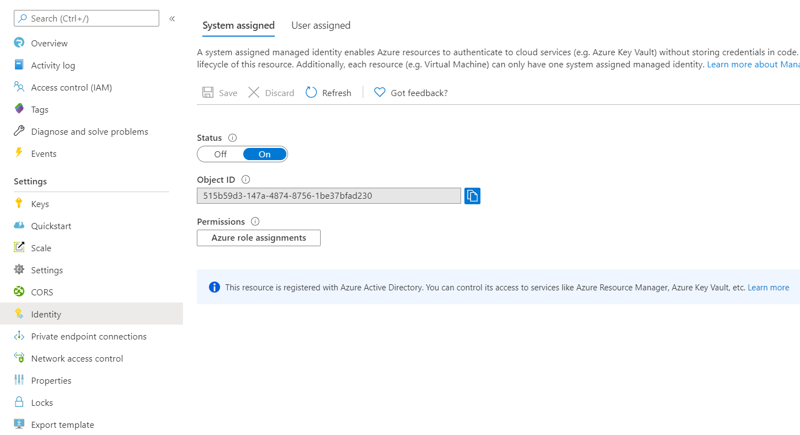
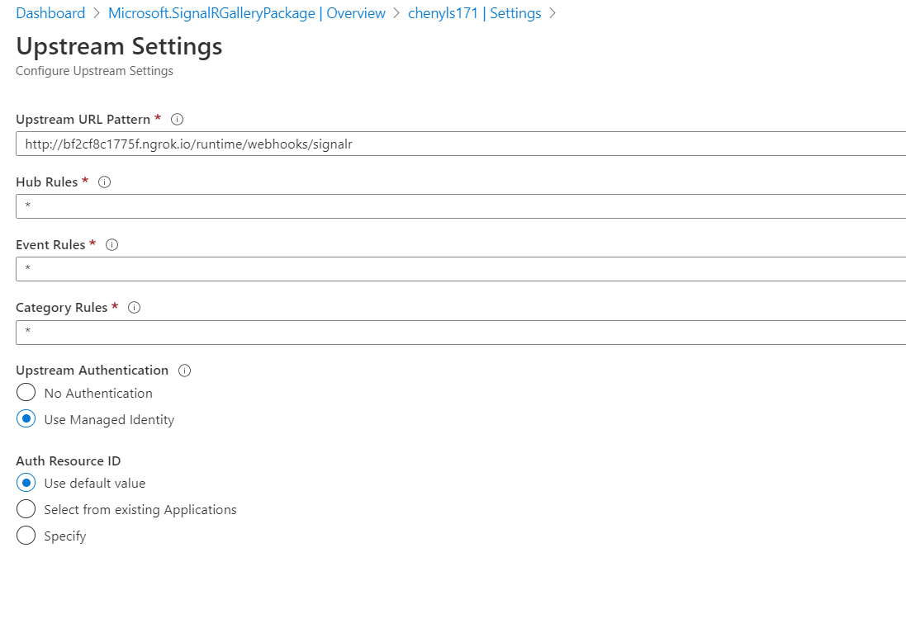
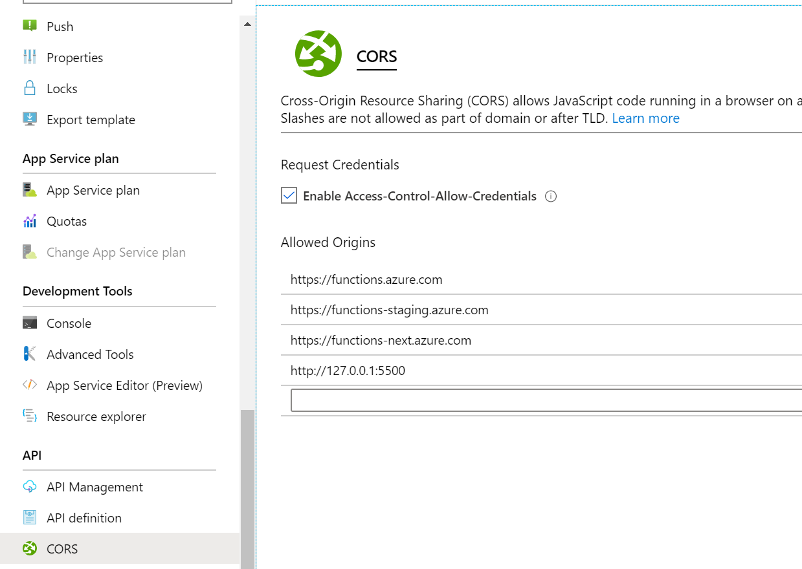
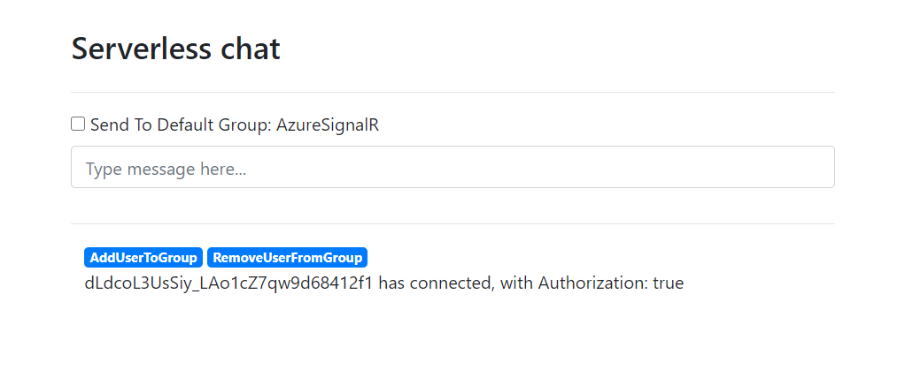

# Azure function bidirectional chatroom sample

This is a chatroom sample that demonstrates bidirectional message pushing between Azure SignalR Service and Azure Function in serverless scenario. It leverages the **upstream** provided by Azure SignalR Service that features proxying messages from client to upstream endpoints in serverless scenario. Azure Functions with SignalR trigger binding allows you to write code to receive and push messages in several languages, including JavaScript, Python, C#, etc.

- [Prerequisites](#prerequisites)
- [Run sample in Azure](#run-sample-in-azure)

<a name="prerequisites"></a>

## Prerequisites

The following softwares are required to build this tutorial.
* [.NET SDK](https://dotnet.microsoft.com/download) (Version 3.1, required for Functions extensions)
* [Azure Functions Core Tools](https://docs.microsoft.com/en-us/azure/azure-functions/functions-run-local?tabs=windows%2Ccsharp%2Cbash#install-the-azure-functions-core-tools) (Version 3)
* [Azure CLI](https://docs.microsoft.com/en-us/cli/azure/install-azure-cli?view=azure-cli-latest)

<a name="run-sample-in-azure"></a>

## Run sample in Azure

It's a quick try of this sample. You will create an Azure SignalR Service and an Azure Function app to host sample. And you will launch chatroom locally but connecting to Azure SignalR Service and Azure Function.

### Create Azure SignalR Service

1. Create Azure SignalR Service using `az cli`

    ```bash
    az signalr create -n <signalr-name> -g <resource-group-name> --service-mode Serverless --sku Free_F1
    ```

    For more details about creating Azure SignalR Service, see the [tutorial](https://docs.microsoft.com/en-us/azure/azure-signalr/signalr-quickstart-azure-functions-javascript#create-an-azure-signalr-service-instance).

### Deploy project to Azure Function

1. Deploy with Azure Functions Core Tools
    1. [Install Azure Functions Core Tools](https://docs.microsoft.com/en-us/azure/azure-functions/functions-run-local?tabs=windows%2Ccsharp%2Cbash#install-the-azure-functions-core-tools)
    2. [Create Azure Function App](https://docs.microsoft.com/en-us/azure/azure-functions/scripts/functions-cli-create-serverless#sample-script) (code snippet shown below)

        ```bash
        #!/bin/bash

        # Function app and storage account names must be unique.
        storageName=mystorageaccount$RANDOM
        functionAppName=myserverlessfunc$RANDOM
        region=westeurope

        # Create a resource group.
        az group create --name myResourceGroup --location $region

        # Create an Azure storage account in the resource group.
        az storage account create \
        --name $storageName \
        --location $region \
        --resource-group myResourceGroup \
        --sku Standard_LRS

        # Create a serverless function app in the resource group.
        az functionapp create \
        --name $functionAppName \
        --storage-account $storageName \
        --consumption-plan-location $region \
        --resource-group myResourceGroup \
        --functions-version 3
        ```

    3. Renaming `local.settings.sample.json` to `local.settings.json`
    4. Publish the sample to the Azure Function you created before.

        ```bash
        cd <root>/bidirectional-chat/csharp
        // If prompted function app version, use --force
        func azure functionapp publish <function-app-name>
        ```

2. Update application settings

    ```bash
    az functionapp config appsettings set --resource-group <resource_group_name> --name <function_name> --setting AzureSignalRConnectionString="<signalr_connection_string>"
    ```

3. Enable Managed Identity

    Change Status to *On* in the *Identity* blade and then click *Save*. As shown below:
    
    

4. Update Azure SignalR Service Upstream settings

    Open the Azure Portal and nevigate to the Function App created before. Find `signalr_extension` key in the **App keys** blade.

    

    Copy the `signalr_extensions` value and use Azure Portal to set the upstream setting.
    - In the *Upstream URL Pattern*, fill in the `<function-url>/runtime/webhooks/signalr?code=<signalr_extension-key>`
        
    - Click the asterisk in *Hub Rules* and a new page pops out as shown below.
        
    - Select *Use Managed Identity* under *Upstream Authentication* and *Use default value* under *Auth Resource ID*

### Use a chat sample website to test end to end

1. Enable function app cross origin resource sharing (CORS)

    Although there is a CORS setting in local.settings.json, it is not propagated to the function app in Azure. You need to set it separately.

    1. Open the function app in the Azure Portal.
    2. In the left blade, select **CORS** blade.
    3. In the **Allowed Origins** section, add `http://127.0.0.1:5500` (It is the local web server's url).
    4. In order for the SignalR JavaScript SDK call your function app from a browser, support for credentials in CORS must be enabled. Select the **Enable Access-Control-Allow-Credentials** checkbox.
    5. Click **Save** to persist the CORS settings.
    

2. Install [Live Server](https://marketplace.visualstudio.com/items?itemName=ritwickdey.LiveServer) for your VS Code, that can serve web pages locally
3. Open `bidirectional-chat/content/index.html` and edit base url

    ```js
    window.apiBaseUrl = '<function-app-url>';
    ```

4. With **index.html** open, start Live Server by opening the VS Code command palette (**F1**) and selecting **Live Server: Open with Live Server**. Live Server will open the application in a browser.

5. Try send messages by entering them into the main chat box.
    
